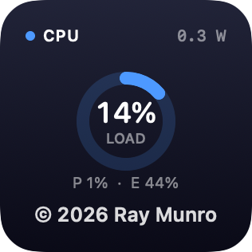
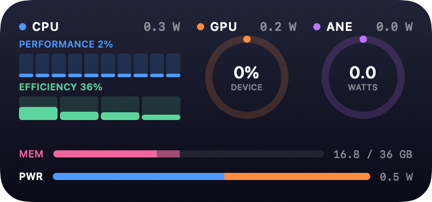
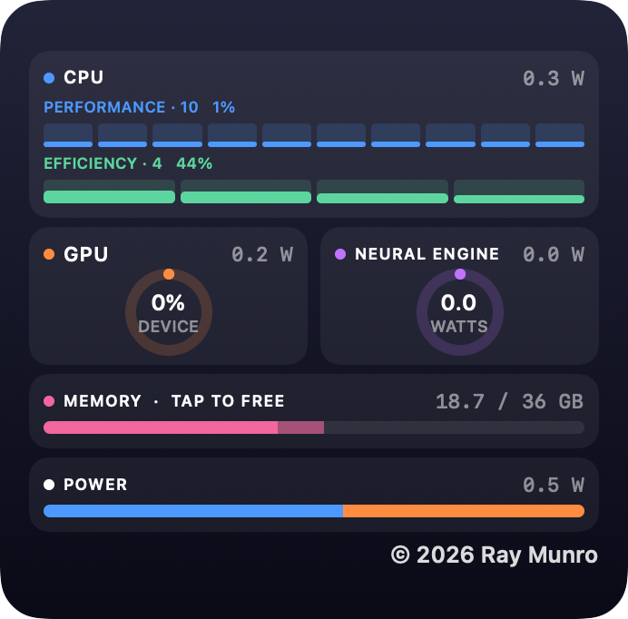
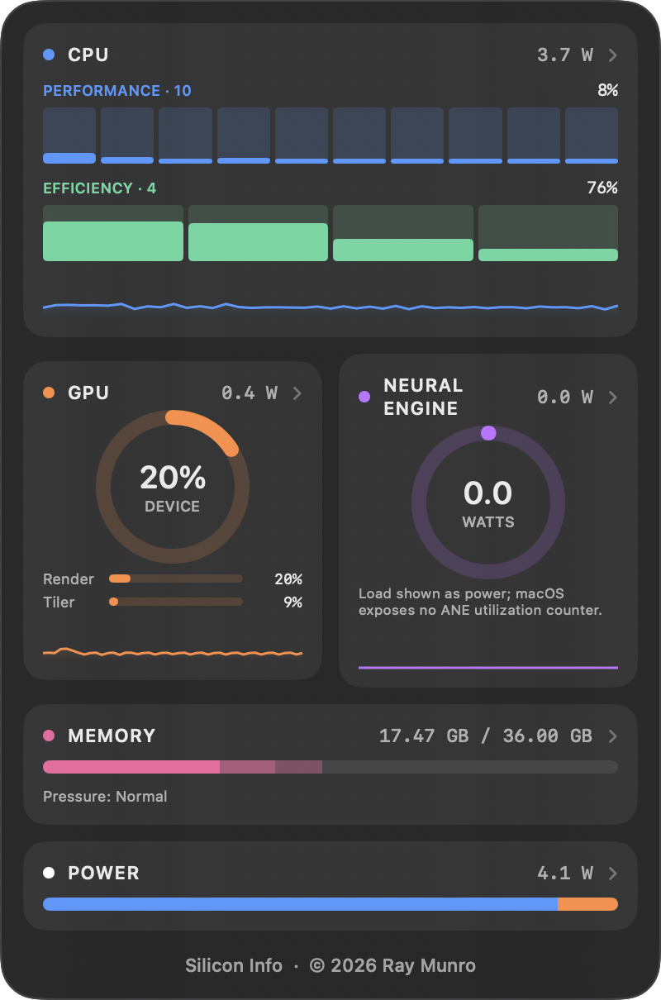
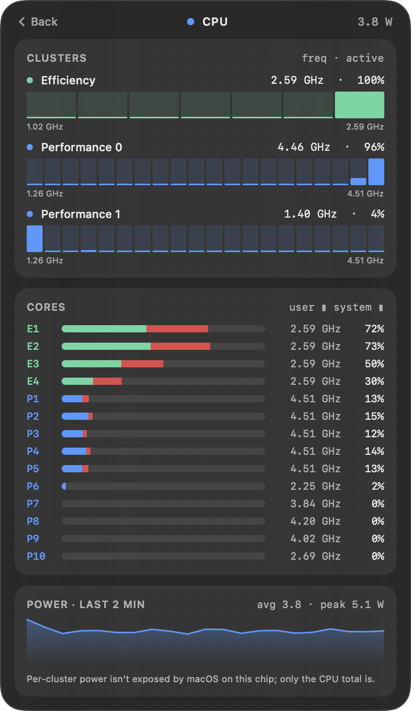
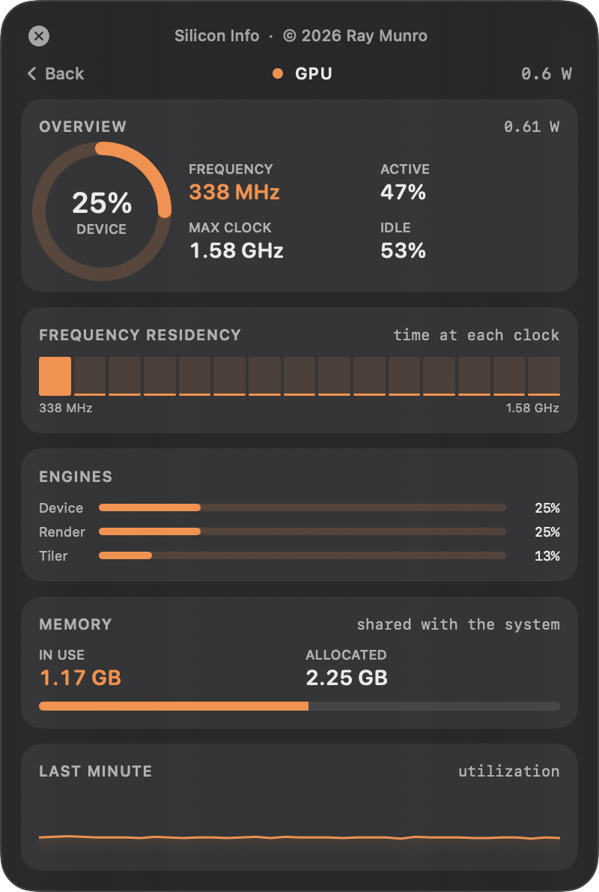
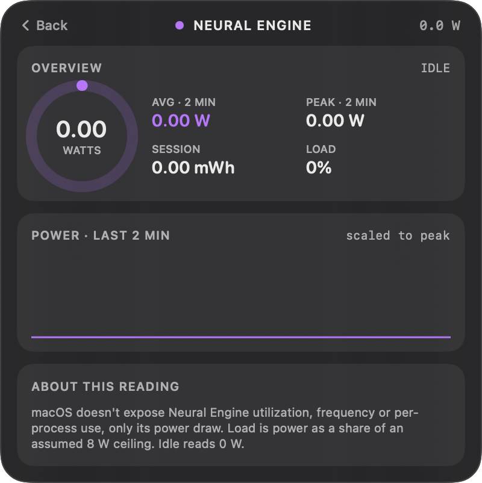
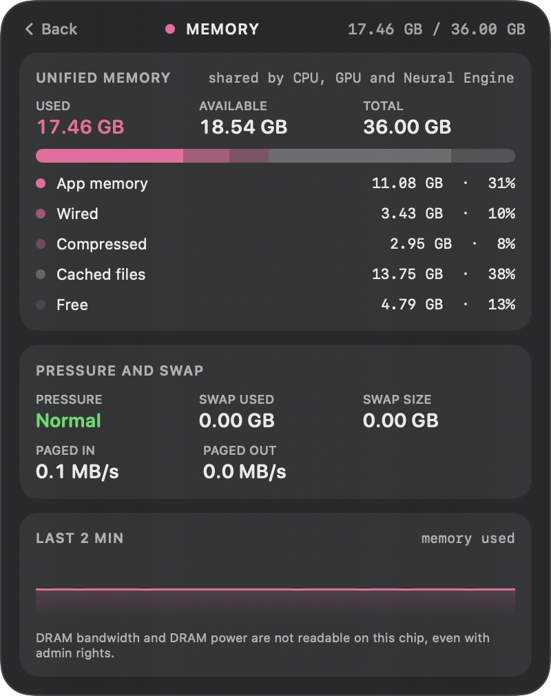
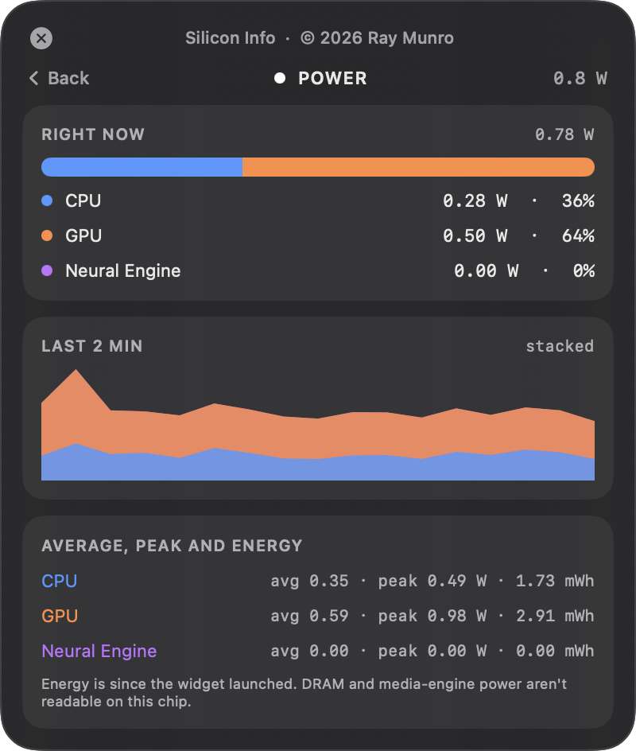

# Silicon Info

A floating desktop widget for Apple Silicon Macs that splits system activity into its parts: CPU performance and efficiency cores, the GPU, the Neural Engine, unified memory (DRAM), and total power. Click any card to expand it into a detailed view. It also ships a real macOS widget (small, medium and large) for the desktop and Notification Center.

Full documentation: [docs/Silicon-Info-Documentation.pdf](docs/Silicon-Info-Documentation.pdf)

## Menu bar

The app also adds a menu bar item that shows the live total CPU load next to its icon. Its menu shows live CPU, GPU, Neural Engine and memory readings, a Hide Panel or Show Panel toggle for the floating panel, and Quit Silicon Info.

To get rid of the floating panel, right-click it and choose Hide Panel (or use the menu bar item). It stays hidden across launches, and the desktop widget and menu bar item keep working. Opening the app again from Finder or Spotlight shows the panel.

## Desktop widget

Run the app once, then right-click the desktop, choose **Edit Widgets** and search for **Silicon Info**.

| Size | Shows |
| --- | --- |
| Small | One component of your choice (CPU, GPU, Neural Engine, Memory or Power). Edit the widget to pick which. |
| Medium | CPU cores, GPU and Neural Engine side by side, with memory and a power split |
| Large | Everything: CPU cores with history, GPU, Neural Engine, memory and power |

The widget is sandboxed and cannot read hardware counters itself, so the Silicon Info app keeps sampling and shares a snapshot with it through an App Group. Keep the app running for fresh data. macOS limits how often widgets redraw, so expect updates every several seconds, not every second like the floating panel. If the app is not running the widget says so.

<table>
  <tr>
    <td align="center"><br><sub>Small</sub></td>
    <td align="center"><br><sub>Medium</sub></td>
    <td align="center"><br><sub>Large</sub></td>
  </tr>
</table>

## Screenshots

<table>
  <tr>
    <td align="center"><br><sub>Overview</sub></td>
    <td align="center"><br><sub>CPU detail</sub></td>
    <td align="center"><br><sub>GPU detail</sub></td>
  </tr>
  <tr>
    <td align="center"><br><sub>Neural Engine detail</sub></td>
    <td align="center"><br><sub>Memory detail</sub></td>
    <td align="center"><br><sub>Power detail</sub></td>
  </tr>
</table>

## Requirements

- A Mac with Apple Silicon
- macOS 14 or later
- Xcode and [XcodeGen](https://github.com/yonaskolb/XcodeGen) (`brew install xcodegen`)
- An Apple Developer team for code signing. Widgets and App Groups will not work with ad hoc signing.

## Build and run

Set your own team in `project.yml` (`DEVELOPMENT_TEAM`), and change the bundle identifiers and the App Group (`875N49PYZ9.com.raymondmunro.siliconinfo` in `project.yml` and `Sources/Shared/WidgetData.swift`) to match your team. Then:

```bash
./build.sh
open build/Build/Products/Release/SiliconInfo.app
```

On launch the widget asks for your administrator password through the standard macOS dialog. This is needed to read power, frequency and per-process figures from `powermetrics`. If you decline, the widget still runs but shows `n/a` for the values that need it.

To hide every list of process names (for screenshots or screen sharing), launch the binary with the privacy option:

```bash
build/Build/Products/Release/SiliconInfo.app/Contents/MacOS/SiliconInfo --hide-processes
```

To quit the widget:

```bash
pkill SiliconInfo
```

## What you see

| Card | Overview | Expanded |
| --- | --- | --- |
| CPU | Per-core bars grouped as performance and efficiency cores, power, history | Cluster frequency and residency, per-core user and system load with clock speed, top processes, power history |
| GPU | Utilization ring, render and tiler load, power | Frequency, residency by clock step, engines, memory, top GPU processes |
| Neural Engine | Power ring and history | Average and peak power, session energy, activity state |
| Memory | Used and total memory with a breakdown bar and pressure level | Breakdown (app, wired, compressed, cached, free), pressure, swap, paging rates, top processes, history |
| Power | CPU, GPU and Neural Engine share of total | Live split, stacked two-minute history, average, peak and energy per block |

## Limits

macOS does not expose some figures on this hardware, so the widget does not show them:

- Neural Engine utilization, frequency or per-process use (only its power draw is available)
- Per-cluster CPU power (only the CPU total)
- DRAM bandwidth and DRAM power (macOS refuses access even with admin rights)
- Media engine power

## Project layout

- `Sources/SiliconInfo/Sampler.swift` collects per-core load, GPU statistics and history
- `Sources/SiliconInfo/Memory.swift` reads unified memory usage, pressure and swap
- `Sources/SiliconInfo/PowerFeed.swift` runs and parses `powermetrics`
- `Sources/SiliconInfo/Views.swift` and `Detail.swift` hold the interface
- `Sources/SiliconInfo/main.swift` creates the floating window
- `Sources/SiliconInfoWidget/` is the WidgetKit extension
- `Sources/Shared/` holds the data model, drawing code and widget layouts used by both
- `project.yml` defines the Xcode project (generated by XcodeGen)
- `scripts/make_icon.swift` draws the app icon
- `build.sh` generates the project and builds the signed app with its widget

## License

Silicon Info is free software: you can redistribute it and modify it under the terms of the GNU General Public License as published by the Free Software Foundation, either version 3 of the License, or (at your option) any later version. It is distributed without any warranty. See [LICENSE](LICENSE) for the full text.

Copyright (C) 2026 Ray Munro.
